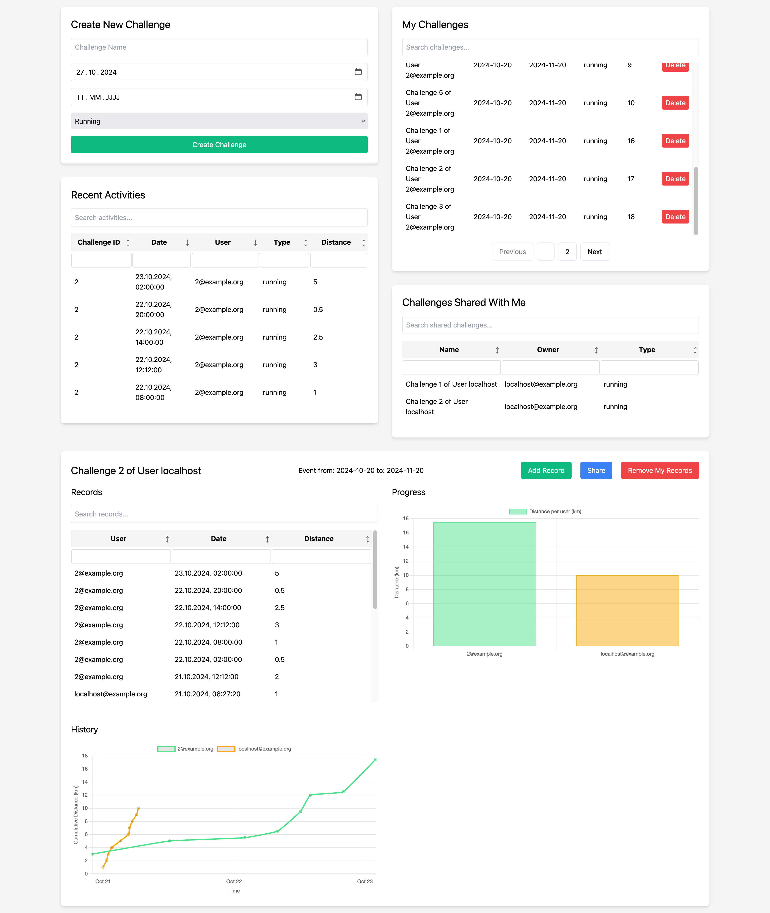

# Challenges Server 

This is a open source and selfhosted fitness challenges server, which allows users to create and manage and share fitness challenges with friends. Users can be created via environment variables in the Docker configuration or through a command-line interface (CLI) (There is no registration currently). The server provides various endpoints for user authentication and challenge management, enabling users to create, share, and delete challenges while tracking their progress through recorded activities.



### Current Features:

_User Creation_
   - Create users using environment variables (limited to 20 users, for testing only).
   - Create users via CLI commands.

_Authentication_
   - Obtain JWT tokens for secure user authentication.

_Challenge Management_ (with UI)
   - Create new challenges. 
   - List challenges created by the user.
   - List challenges shared with the user.
   - View specific challenges by ID.
   - List challenges shared from other users.
   - Share challenges with other users via email.
   - Delete challenges by ID.
   - Insert challenge records to track activities (e.g., distance, type).
   - Show challenge records, including those shared with the user.


# Quick start
### build and run with docker

NOTE: currently development only, ports need to be closed and passwords/secrets changed in production env. Use at your own risk!!!

```
# build
docker build -t postgres-challenges:local -f db-postgres/Dockerfile-postgres db-postgres

# start
docker compose up -d 

# logs
docker compose logs -f

```

---
---

## user creation

### Option 1: create user via cli

```
docker exec -it db_challenges bash add-user.sh username="user@example.org" password="securepassword"
```

### Option 2: env variables in docker-compose.yml file
(not recommended, for testing only, max 20 users limit)

```
  db_challenges:
    environment:
      ... all the other variables()
      USER1_EMAIL: "localhost@example.org"
      USER1_PASSWORD: securepassword
```

## Open UI

- open Browser on `http://localhost:81`
- enter for `URL` default value `http://localhost:3000` (your postgREST server port)
- default user: `localhost@example.org`
- default pass: `securepassword`

---
---


## debugging and testing

#### 0. get to psql
`docker exec -it db_challenges psql -U challenges_user challenges`

#### 1. obtain a JWT token
```
TOKEN=$(curl -X POST "http://localhost:3000/rpc/login" \
  -H "Content-Type: application/json" \
  -d '{ "email": "localhost@example.org", "pass": "securepassword" }' | jq -r .token)

# Debugging the token
echo "Using token: $TOKEN"
```

#### 2. create a challenge
```
curl http://localhost:3000/challenge_list -X POST \
  -H "Authorization: Bearer $TOKEN" \
  -H "Content-Type: application/json" \
  -d '{
        "name": "Test Challenge",
        "from": "2024-10-20",
        "to": "2024-11-20",
        "type": "running"
      }'
```

#### 3. list challenges created by user
```
curl http://localhost:3000/challenge_list \
  -H "Authorization: Bearer $TOKEN" \
  -H "Content-Type: application/json"
```

#### 4. list challenges created by user and the ones shared with user  
```
curl http://localhost:3000/user_challenges \
  -H "Authorization: Bearer $TOKEN" \
  -H "Content-Type: application/json"
```


#### 5. show specific challenge_id "1"
```
curl http://localhost:3000/challenge_list\?challenge_id\=eq.1 \
-H "Authorization: Bearer $TOKEN"
```

#### 6. list only challenges shared from another user
```
curl http://localhost:3000/shared_challenges \
  -H "Authorization: Bearer $TOKEN" \
  -H "Content-Type: application/json"
```

#### 7. share challenge (by challenge_id) with user (email)
```
curl http://localhost:3000/challenge_shares -X POST \
  -H "Authorization: Bearer $TOKEN" \
  -H "Content-Type: application/json" \
  -d '{
        "challenge_id": "1",
        "shared_with": "localhost@example.org"}'
```

#### 8. Delete a challenge (in this example challenge_id = "1")
```
curl http://localhost:3000/challenge_list\?challenge_id\=eq.1 -X DELETE \
  -H "Authorization: Bearer $TOKEN" \
  -H "Content-Type: application/json"
```

#### 9. insert challenge_records into challenge_id
```
curl http://localhost:3000/challenge_records -X POST \
  -H "Authorization: Bearer $TOKEN" \
  -H "Content-Type: application/json" \
  -d '{
        "challenge_id": 2,
        "timestamp": 1698019200,
        "type": "running",
        "distance": 11.5
      }'
```

#### 10. show challenge records of shared as well
```
curl http://localhost:3000/shared_challenge_records \
  -H "Authorization: Bearer $TOKEN" \
  -H "Content-Type: application/json"
```


### generate a JWT token for server
```bash
# Allow "tr" to process non-utf8 byte sequences
export LC_CTYPE=C

# Read random bytes keeping only alphanumerics and add the secret to the configuration file
echo "jwt-secret = \"$(< /dev/urandom tr -dc A-Za-z0-9 | head -c32)\"" >> tutorial.conf
```


### get token

```bash
curl -X POST "http://localhost:3000/rpc/login" \
  -H "Content-Type: application/json" \
  -d '{ "email": "localhost@example.org", "pass": "securepassword" }'

```


